# Supplementary C/CUDA root-solving experiments

本仓库是 [`docs/SUPPLEMENTARY_EXPERIMENTS_C_CUDA.md`](docs/SUPPLEMENTARY_EXPERIMENTS_C_CUDA.md) 的可追溯 C17/CUDA C++ 实验实现。2026-08-24 的历史验收范围曾排除E8；2026-08-26已完成RTX 5090、RTX 4090、RTX 3090、V100与A100五卡冻结复现。正确性和目标预算在五卡迁移；合格混合精度方法在三张消费级卡加速、在强FP64的V100/A100变慢。RTX 5090冻结路由在3090/4090通过5%迁移门，但不能直接搬到V100/A100。

五域包括解析 BEM、Kepler、单二极管 PV、非等温 CSTR 和 Peng–Robinson 负对照。另有基于 OpenFAST/NREL 5 MW、真实翼型极坐标表的 600 s BEM 工作流。CPU/GPU 对比保持相同残差、物理分支、停止条件和输入；计时分别保存纯内核与 H2D+kernel+D2H，原始结果为追加式时间戳目录。

## OpenFAST 真实数据论文图

[`paper_figures/real_simulation_v1/`](paper_figures/real_simulation_v1/) 提供三组纯二维、可直接用于论文排版的可复现图：TurbSim 瞬时转子平面三分量流场与真实叶片投影、单个真实叶素从翼型/速度三角形到极坐标插值和非线性残差项的完整诊断、以及全部 2,448,000 个 OpenFAST 参考根的二维时空矩阵。全部图只使用真实数据切片或精确 C 公式，不包含三维重建。数据边界、建议图注和复现命令见 [`FIGURE_NOTES.md`](paper_figures/real_simulation_v1/FIGURE_NOTES.md)。

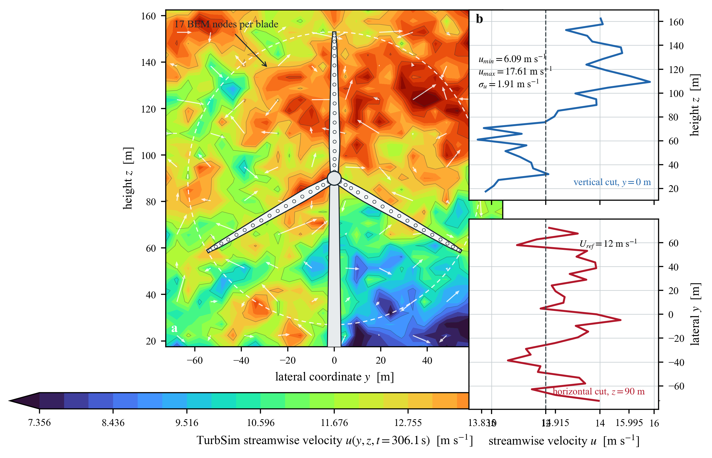

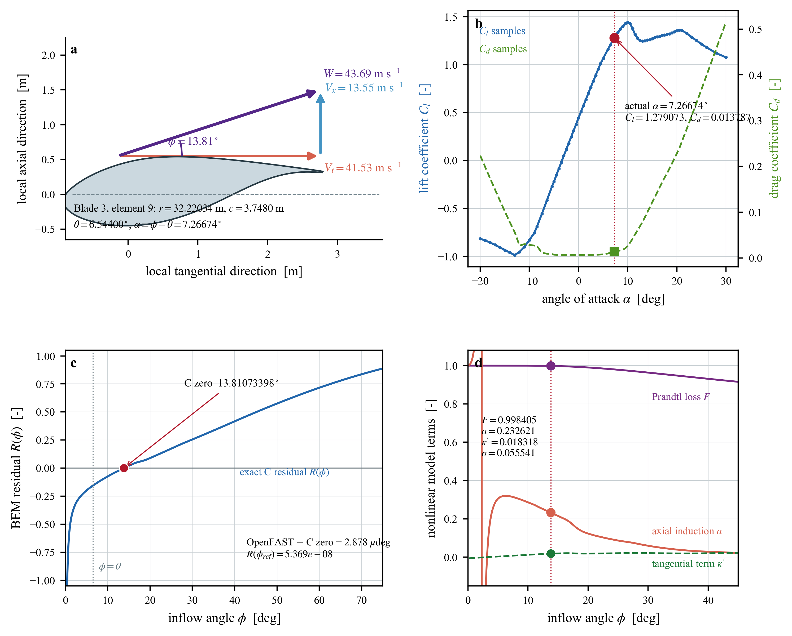

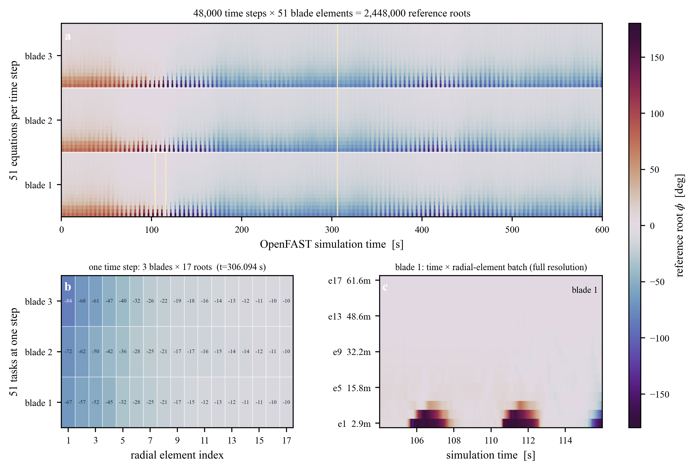

## Four non-BEM application-framework figures

[`paper_figures/domain_frameworks_v1/`](paper_figures/domain_frameworks_v1/) extends the same data-driven two-dimensional treatment to Kepler, photovoltaic, CSTR and Peng-Robinson cases.  The application calculations were actually run with Orekit 13.1.5, pvlib 0.15.2, Cantera 3.2.0 and CoolProp 8.0.0.  Framework outputs, exact benchmark checks, source hashes and zero-overlap layout audits are committed with the figures.  The framework-to-equation mapping and the important CSTR non-identity boundary are documented in [`DOMAIN_FRAMEWORK_RESEARCH_V1.md`](docs/DOMAIN_FRAMEWORK_RESEARCH_V1.md).

For a space-efficient manuscript layout, Figure 9 combines the Kepler, PV and CSTR solved fields with directly matched line cuts; embedded count chains expose all 14,829 independent roots without separate white-background validation panels. A data-checked knowledge layer identifies response directions, physical mechanisms, operating regions and the shared CSTR extinction boundary; haloed contours and annotations remain legible over every part of the gradient fields.

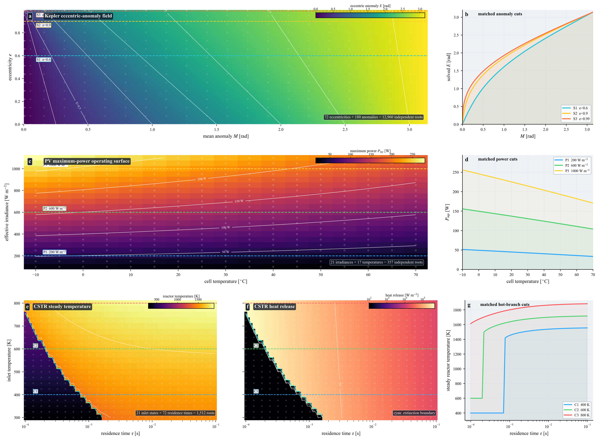

The large-type manuscript versions split the overview by physical domain:

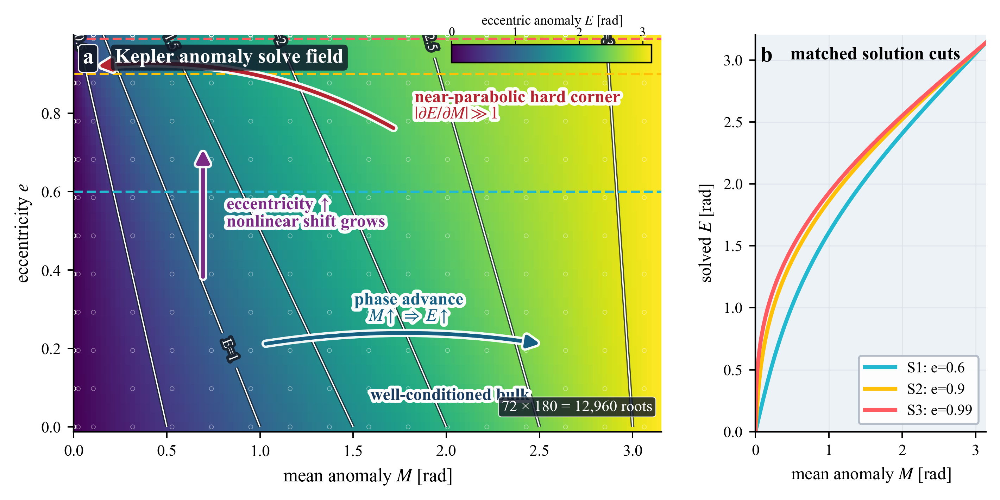

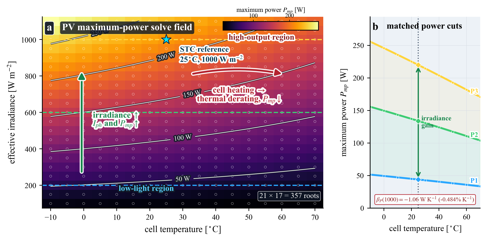

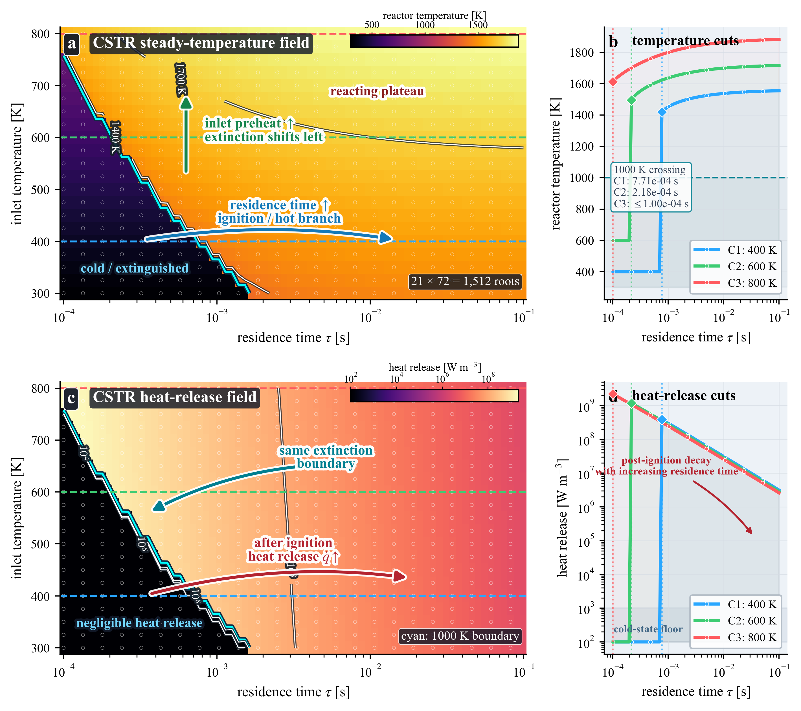

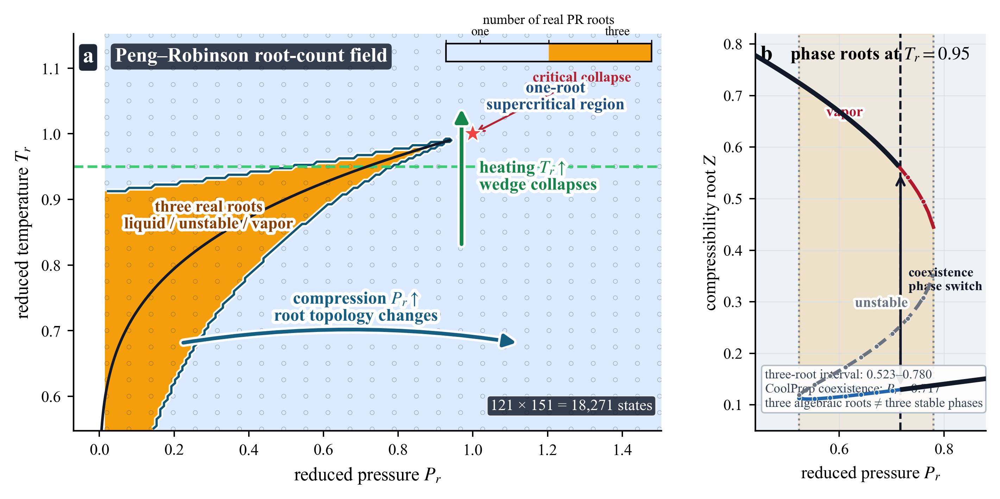

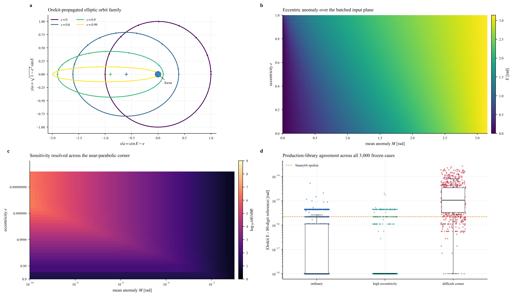

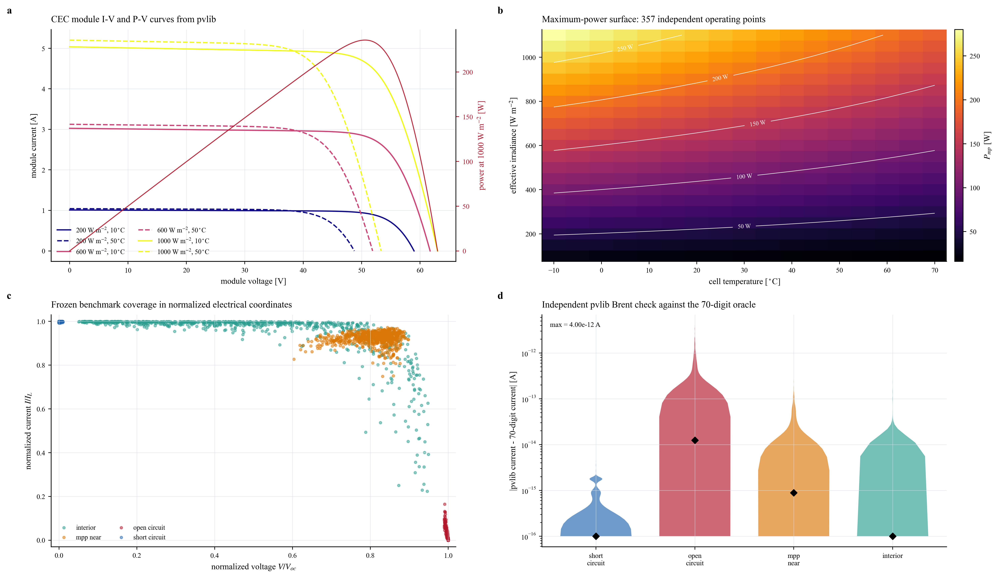

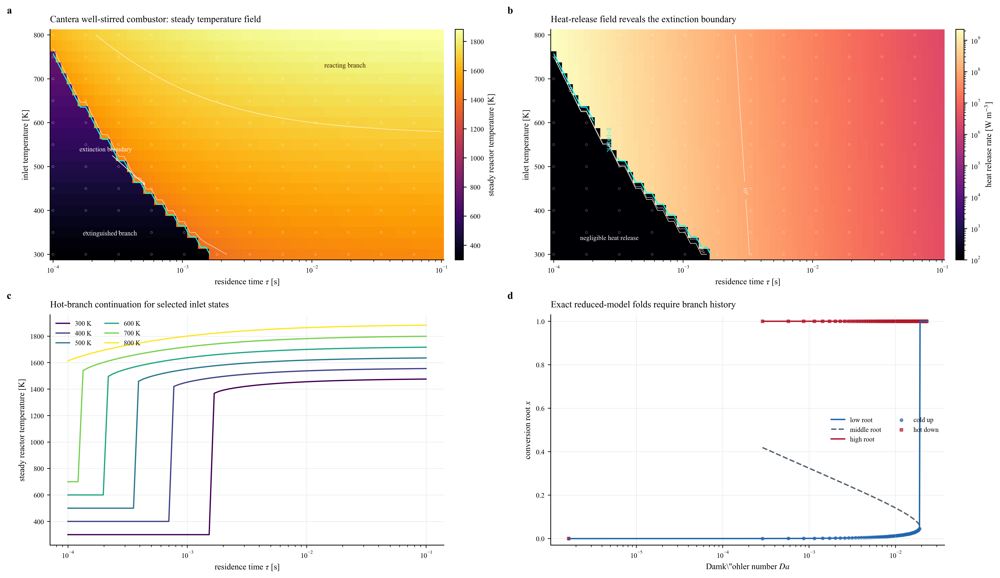

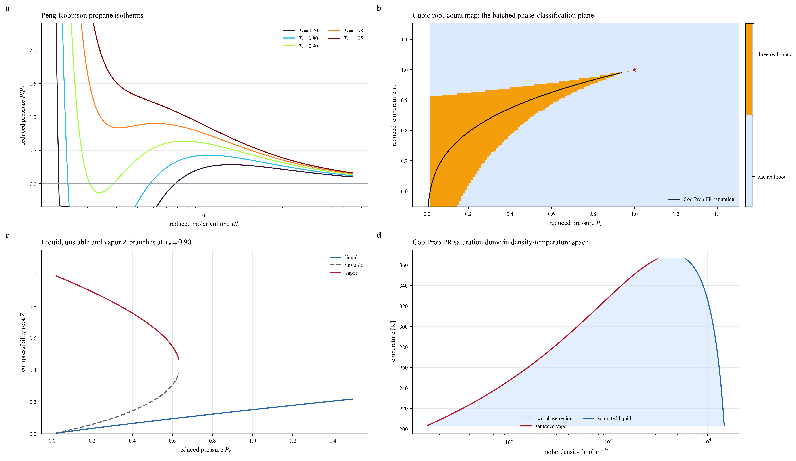

## 权威结果

- `results_processed/FROZEN_CORRECTNESS_V3.md`：五域冻结高精度正确性；V1/V2 保留为历史/失败候选。
- `results_processed/GPU_PERFORMANCE_V3_RTX5090.md`：五域 15,600 次正式 GPU 重复、规模扩展和端到端结果。
- `results_processed/CPU_C17_PERFORMANCE_V1.md`：严格串行、SIMD、OpenMP 96 线程和 PGO 的 7,800 次 CPU 重复及 CPU/GPU 临界规模。
- `results_processed/ALGORITHM_PERFORMANCE_RTX5090_V2.md`：完整通用与专用算法候选矩阵；V1 不含全部专用方法，已作废。
- `results_processed/BEM_REAL_FROZEN_RTX5090_V1.md`：真实翼型表 BEM 的独立 80 位冻结核验。
- `results_processed/BEM_REAL_ALGORITHM_MATRIX_RTX5090_V2.md`：同语义 Bisection/Brent/Illinois/fixed/adaptive 对比。
- `results_processed/BEM_REAL_PRECISION_PATHS_RTX5090_V1.md`：FP32、double-single、FP64 与条件感知纠错；只有 `df32_adaptive` 同时通过冻结正确性并显著快于 FP64。
- `results_processed/BEM_REAL_CPU_GPU_V1.md`：真实 BEM 严格 CPU/GPU 公平对比。
- `results_processed/BEM_OPENFAST_MULTICONDITION_V1.md`：12 m/s 基线之外的 8 m/s IEC C 与 16 m/s IEC A 独立 600 s 工况、oracle 与计时。
- `results_processed/PV_EXTENDED_GRADIENTS_RTX5090_V1.md`、`CSTR_FOLD_VALIDATION_RTX5090_V1.md`、`BEM_REAL_FINITE_DIFFERENCE_V1.md`：扩展可微性、多根/折叠与重新求解有限差分核验。
- `results_processed/BEM_SCALE_CONDITION_ABLATIONS_RTX5090.md`、`REMAINING_CUDA_ABLATIONS_RTX5090.md`、`NSIGHT_COMPUTE_RTX5090_V1.md`：A0–A10 消融及直接 GPU profiling。
- `results_processed/CPU_FAST_MATH_V1.md` 与 `FAST_MATH_CANDIDATE_RTX5090.md`：CPU/CUDA 编译策略严格分开。
- `results_processed/FINAL_ACCEPTANCE_NO_E8.md`：最终范围、证据映射、正负结果和机械审计入口。
- `docs/PAPER_CLAIM_EVIDENCE_MATRIX.md`：写作前的“主张—结果—原始证据—适用边界”冻结矩阵。
- `docs/CERTIFICATE_GUIDED_ALGORITHM_V1.md`：E12–E16 新算法的理论条件、实现身份与不可越界表述。
- `results_processed/E12_E16_CERTIFICATE_GOAL_ROUTING_RTX5090_V1.md`：认证精度选择、目标预算、动态路由与组合消融正式报告。
- `results_processed/FINAL_ACCEPTANCE_E0_E16_WITH_E8.md`：包含E8五卡矩阵的最终总验收入口；历史 `NO_E8` 报告保留用于追踪范围演变。
- `docs/E8_CROSS_ARCHITECTURE_PROTOCOL_V1.md`、`results_processed/E8_CROSS_ARCHITECTURE_FIVE_GPU_FINAL_V4.md`：E8冻结协议与五卡最终报告；V1–V3保留为历史阶段结果。

“实验完成”不等于所有候选成功。全局 CUDA fast-math 因 CSTR 换根被拒绝；纯 FP32、无纠错 df32、固定 44 步、O(1) 极坐标 LUT 和原始 FP32→FP64 adaptive 均为正式负结果。Peng–Robinson 的 GPU 大批量加速也为负结果。失败运行、失败样本和旧版本均保留，不得选择性删除。

## 构建与复现

RTX 5090 主机只有 NVIDIA 驱动，CUDA 编译/运行使用固定 Docker 镜像。典型五域入口为：

```bash
bash scripts/run_rtx5090.sh
```

各正式 runner、冻结 manifest、一次性 test marker、源文件 SHA-256、编译日志、硬件/驱动/温度记录和 CSV/JSON 位于 `scripts/`、`manifests/`、`references/` 与 `results_raw/<run_id>/`。`scripts/audit_final_no_e8.py`保留为历史验收；恢复后的跨架构单机审计入口为`scripts/audit_e8_cross_architecture.py`。

GitHub 版本包含全部源码、协议、冻结参考、正式/失败候选的 CSV/JSON/TXT/日志、Nsight CSV、处理后报告和审计结果。超过普通 GitHub 单文件限制、且可由 runner 重建的 `.bin/.outb/.bts` 与编译产物不进入 Git 历史；其身份、哈希和复现边界见 [`docs/GITHUB_DATA_POLICY.md`](docs/GITHUB_DATA_POLICY.md)。
